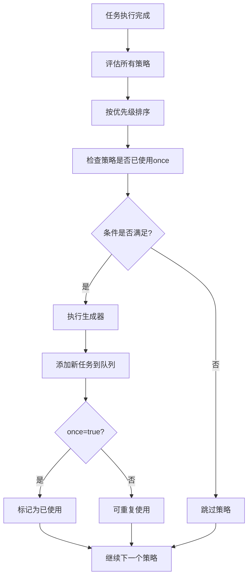

# 🚀 智能工作流引擎

一个强大的工作流引擎，支持 DAG（有向无环图）任务调度、动态任务生成和智能策略系统。

[English](./README.md)

## ✨ 核心特性

### 🔄 **强大的DAG任务调度**
- 自动任务依赖解析和拓扑排序
- 智能并行执行优化
- 循环依赖检测
- 优雅的错误处理和恢复

### 🧠 **智能动态策略系统**
- 条件触发任务生成
- 基于任务结果的动态规划
- 上下文变化监听
- LLM驱动的智能任务规划

### ⚡ **高性能执行引擎**
- O(V+E) 复杂度的拓扑排序
- 自动并行执行无依赖任务
- 内存优化和延迟初始化
- 完整的执行监控和指标

## 🚀 快速开始

### 安装

```bash
npm install agent-workflow
# 或
yarn add agent-workflow  
# 或
pnpm add agent-workflow
```

### 基础用法 - 简单任务流

```typescript
import { WorkflowBuilder } from 'agent-workflow';

// 定义任务
class DataProcessTask implements DAGTask {
  name = 'dataProcess';
  async execute(input: TaskInput) {
    const processed = input.rawData.toUpperCase();
    return { ...input, processed };
  }
}

class AnalysisTask implements DAGTask {
  name = 'analysis';
  async execute(input: TaskInput) {
    const analysis = `分析结果: ${input.processed}`;
    return { ...input, analysis };
  }
}

// 🔥 简洁强大 - 1行搞定
const result = await WorkflowBuilder
  .create()
  .addTask(new DataProcessTask())
  .addTask(new AnalysisTask())
  .build()
  .execute({ rawData: 'hello world' });

console.log(result.data.analysis); // "分析结果: HELLO WORLD"
```

### 智能动态工作流 - 条件任务生成

```typescript
const workflow = WorkflowBuilder
  .create()
  .addTask(new CodeScanTask())
  .whenCondition(
    // 当发现TypeScript文件时
    (context) => {
      const fileTypes = context.get('discoveredTypes') as string[];
      return fileTypes?.includes('typescript');
    },
    // 自动生成TS相关任务
    async (context) => [
      new TypeCheckTask(),
      new TSLintTask(),
      new TypeCoverageTask()
    ]
  )
  .build();

const result = await workflow.execute({ projectPath: './src' });
console.log(`智能生成了 ${result.dynamicTasksGenerated} 个任务`);
```

### 基于结果的动态规划

```typescript
const workflow = WorkflowBuilder
  .create()
  .addTask(new SecurityScanTask())
  .onTaskComplete('securityScan', async (result, context) => {
    const tasks = [];
    const issues = result.vulnerabilities || [];
    
    // 根据扫描结果动态生成修复任务
    if (issues.includes('xss')) {
      tasks.push(new XSSFixTask());
    }
    if (issues.includes('sql-injection')) {
      tasks.push(new SQLInjectionFixTask());
    }
    
    return tasks;
  })
  .build();
```

### LLM驱动的智能工作流

```typescript
// 🤖 AI自动规划任务流程
const result = await WorkflowBuilder
  .create()
  .withLLMModel('gpt-4-turbo')
  .withDynamicPlanning('分析这个Vue项目，生成代码质量报告')
  .build()
  .execute({ projectPath: './my-vue-app' });

console.log('AI自动生成的分析报告:', result.data);
```

## 🎛️ 高级配置

### 完整配置示例

```typescript
const workflow = WorkflowBuilder
  .create()
  .withConfig({
    llmModel: 'gpt-4-turbo',
    retryAttempts: 3,
    timeoutMs: 60000,
    maxDynamicSteps: 20
  })
  .addTask(new InitTask())
  .addDynamicStrategy({
    name: 'error_recovery',
    condition: (context) => context.get('hasError') === true,
    generator: async (context) => [new ErrorRecoveryTask()],
    priority: 10, // 高优先级
    once: true    // 只执行一次
  })
  .build();
```

### 任务依赖管理

```typescript
const task1 = new DataFetchTask();
const task2 = new DataProcessTask();
task2.dependsOn = [task1]; // 声明依赖

const task3 = new DataAnalysisTask();
task3.dependsOn = [task1, task2]; // 多重依赖

const workflow = WorkflowBuilder
  .create()
  .addTasks([task1, task2, task3]) // 自动处理依赖顺序
  .build();
```

## 🔧 动态策略系统

动态策略是工作流引擎的智能核心，可以根据执行过程中的条件**动态生成新任务**，让工作流具备"自适应"能力。

### 🎯 动态策略架构

```typescript
interface DynamicStrategy {
  name: string;                                           // 策略标识符
  condition: (context: WorkflowContext, result?: any) => boolean;  // 触发条件
  generator: (context: WorkflowContext) => Promise<DAGTask[]>;     // 任务生成器
  priority?: number;                                      // 执行优先级（数字越大越优先）
  once?: boolean;                                         // 一次性执行标志
}
```

### 📋 策略参数详细说明

#### **name: string**
- **作用**: 策略的唯一标识符
- **用途**: 
  - 日志输出和监控显示
  - `once: true` 时追踪已执行策略
  - 调试和问题排查

#### **condition: (context, result?) => boolean**
- **作用**: 决定策略何时触发
- **工作机制**: 
  - 在每个执行步骤后被调用
  - 接收当前工作流上下文
  - 返回 `true` 触发策略，`false` 跳过

#### **generator: (context) => Promise<DAGTask[]>**
- **作用**: 动态生成新任务
- **工作机制**:
  - 条件满足时调用此函数
  - 接收当前上下文作为参数
  - 返回需要添加到工作流的新任务数组

#### **priority?: number (默认: 0)**
- **作用**: 控制策略执行顺序
- **工作机制**:
  ```typescript
  // 策略按优先级从高到低排序执行
  const sortedStrategies = [...strategies].sort(
    (a, b) => (b.priority || 0) - (a.priority || 0)
  );
  ```
- **典型用法**:
  - `priority: 10` - 高优先级（错误处理、关键任务）
  - `priority: 5` - 中等优先级（常规业务逻辑）
  - `priority: 1` - 低优先级（清理、日志记录）

#### **once?: boolean (默认: false)**
- **作用**: 控制策略是否只能执行一次
- **工作机制**:
  ```typescript
  // 跳过已使用的一次性策略
  if (strategy.once && this.usedStrategies.has(strategy.name)) {
    continue;
  }
  
  // 标记策略为已使用
  if (strategy.once) {
    this.usedStrategies.add(strategy.name);
  }
  ```
- **使用场景**:
  - `once: true` - 初始化、错误恢复、一次性设置
  - `once: false` - 持续监控、重复任务

### 🔄 策略执行流程



### 1. 条件策略 - `whenCondition()`

```typescript
.whenCondition(
  (context) => context.get('environment') === 'production',
  async (context) => [
    new SecurityAuditTask(),
    new PerformanceTestTask()
  ]
)
```

### 2. 任务完成策略 - `onTaskComplete()`

```typescript
.onTaskComplete('codeAnalysis', async (result, context) => {
  const tasks = [];
  
  if (result.complexity > 0.8) {
    tasks.push(new RefactorSuggestionTask());
  }
  
  if (result.coverage < 0.7) {
    tasks.push(new TestGenerationTask());
  }
  
  return tasks;
})
```

### 3. 上下文变化策略 - `onContextChange()`

```typescript
.onContextChange('framework', async (framework, context) => {
  switch (framework) {
    case 'react':
      return [new ReactLintTask(), new ReactTestTask()];
    case 'vue':
      return [new VueLintTask(), new VueTestTask()];
    case 'angular':
      return [new AngularLintTask(), new AngularTestTask()];
    default:
      return [new GenericLintTask()];
  }
})
```

### 4. 自定义策略 - `addDynamicStrategy()`

```typescript
.addDynamicStrategy({
  name: 'performance_optimization',
  condition: (context, result) => {
    const metrics = context.get('performanceMetrics');
    return metrics?.loadTime > 3000; // 加载时间超过3秒
  },
  generator: async (context) => [
    new ImageOptimizationTask(),
    new CodeSplittingTask(),
    new CacheOptimizationTask()
  ],
  priority: 5,
  once: false // 可以多次触发
})
```

### 💡 实际应用场景

#### 🚨 错误恢复策略
```typescript
.addDynamicStrategy({
  name: 'error_recovery',
  condition: (context) => context.get('hasError') === true,
  generator: async (context) => [
    new ErrorAnalysisTask(),     // 分析错误
    new ErrorFixTask(),          // 修复错误  
    new ValidationTask()         // 验证修复
  ],
  priority: 10,  // 最高优先级，错误时优先处理
  once: true     // 一次性，避免无限错误循环
})
```

#### 🔍 性能监控策略
```typescript
.addDynamicStrategy({
  name: 'performance_monitoring', 
  condition: (context) => {
    const metrics = context.get('performanceMetrics');
    return metrics?.loadTime > 5000; // 超过5秒
  },
  generator: async (context) => [
    new PerformanceOptimizationTask(),
    new CacheOptimizationTask()
  ],
  priority: 5,   // 中等优先级
  once: false    // 可重复触发，持续监控
})
```

#### 🧪 测试覆盖率策略
```typescript
.addDynamicStrategy({
  name: 'test_coverage_boost',
  condition: (context) => {
    const coverage = context.get('testCoverage');
    return coverage < 0.8; // 覆盖率低于80%
  },
  generator: async (context) => [
    new TestGenerationTask(),
    new CoverageAnalysisTask()
  ],
  priority: 3,   // 较低优先级
  once: true     // 一次性生成即可
})
```

### 🎯 策略设计最佳实践

#### 1. **优先级设计原则**
```typescript
// 紧急情况 - 最高优先级
priority: 10  // 错误恢复、安全问题
priority: 8   // 数据一致性、关键业务

// 常规业务 - 中等优先级  
priority: 5   // 正常业务逻辑
priority: 3   // 优化改进

// 辅助功能 - 低优先级
priority: 1   // 日志记录、清理任务
priority: 0   // 统计、报告
```

#### 2. **once参数选择**
```typescript
// once: true 适用场景
- 初始化任务
- 错误恢复  
- 一次性配置
- 数据迁移

// once: false 适用场景  
- 性能监控
- 数据同步
- 持续优化
- 定期检查
```

#### 3. **条件设计技巧**
```typescript
// 简单布尔条件
condition: (context) => context.get('needsOptimization') === true

// 复杂逻辑条件
condition: (context) => {
  const metrics = context.get('metrics');
  const config = context.get('config');
  return metrics?.errorRate > 0.05 && config?.env === 'production';
}

// 基于执行历史的条件
condition: (context) => {
  const history = context.getExecutionHistory();
  return history.some(h => h.status === 'failed');
}
```

这个动态策略系统让工作流具备了**自适应能力**，能根据执行过程中的实际情况智能地调整执行计划，是工作流引擎的核心智能特性！🚀

## 📊 执行监控与结果

### 详细的执行结果

```typescript
interface WorkflowResult {
  success: boolean;                              // 是否成功
  data?: any;                                   // 最终数据
  error?: Error;                                // 错误信息
  executionTime: number;                        // 总执行时间(ms)
  taskResults: Map<string, TaskExecutionResult>; // 每个任务的详细结果
  dynamicTasksGenerated?: number;               // 动态生成的任务数
  totalSteps?: number;                          // 总执行步数
}

// 使用示例
const result = await workflow.execute();

if (result.success) {
  console.log(`✅ 工作流成功完成`);
  console.log(`📊 执行时间: ${result.executionTime}ms`);
  console.log(`🎯 动态生成任务: ${result.dynamicTasksGenerated}个`);
  console.log(`📈 总执行步数: ${result.totalSteps}`);
  
  // 查看具体任务结果
  result.taskResults.forEach((taskResult, taskName) => {
    console.log(`任务 ${taskName}: ${taskResult.status} (${taskResult.duration}ms)`);
  });
} else {
  console.error(`❌ 工作流失败:`, result.error?.message);
}
```

### 执行历史追踪

```typescript
const workflow = WorkflowBuilder.create()
  .addTask(new TaskA())
  .addTask(new TaskB())
  .build();

await workflow.execute();

// 获取详细执行历史
const history = workflow.getContext().getExecutionHistory();
history.forEach(record => {
  console.log(`${record.taskName}: ${record.status} (${record.duration}ms)`);
});
```

## 🎯 最佳实践

### 1. 任务设计原则

```typescript
class WellDesignedTask implements DAGTask {
  constructor(
    public name: string,
    private config: TaskConfig
  ) {}

  async execute(input: TaskInput): Promise<Record<string, any>> {
    // ✅ 输入验证
    this.validateInput(input);
    
    // ✅ 幂等性设计
    if (this.isAlreadyProcessed(input)) {
      return this.getCachedResult(input);
    }
    
    // ✅ 核心业务逻辑
    const result = await this.processData(input);
    
    // ✅ 结果缓存
    this.cacheResult(input, result);
    
    return result;
  }
}
```

### 2. 错误处理策略

```typescript
const robustWorkflow = WorkflowBuilder
  .create()
  .withConfig({ 
    retryAttempts: 3,
    timeoutMs: 30000 
  })
  .addTask(new RiskyTask())
  .addDynamicStrategy({
    name: 'error_fallback',
    condition: (context) => context.get('lastTaskFailed'),
    generator: async (context) => [new FallbackTask()],
    priority: 1
  })
  .build();
```

### 3. 性能优化建议

- **并行优化**: 减少不必要的任务依赖
- **内存管理**: 及时清理大对象
- **延迟加载**: 按需初始化重量级组件
- **策略优先级**: 合理设置策略执行顺序

## 📚 更多示例

查看 [examples](./examples) 目录获取更多实际使用案例：

### 🚀 运行示例

```bash
# 1. 基础工作流示例 - 展示简单的任务依赖和执行
npx tsx examples/basic-workflow.ts

# 2. 动态策略示例 - 展示四种动态策略的实际应用
npx tsx examples/dynamic-strategies.ts

# 3. LLM集成示例 - 展示AI驱动的工作流（模拟）
npx tsx examples/llm-integration.ts

# 4. 错误处理示例 - 展示容错机制和恢复策略
npx tsx examples/error-handling.ts

# 5. 流式工作流示例 - 展示实时流式数据返回
npx tsx examples/streaming-workflow.ts

# 🔥 新增：高级AI功能
# 6. AI SDK流式示例 - 展示AI SDK兼容工作流
npx tsx examples/ai-sdk-streaming-workflow.ts

# 7. 简化Agent API示例 - 展示OpenAI Agent SDK兼容接口
npx tsx examples/simple-agent-style.ts

# 8. AI规划器示例 - 展示智能工作流生成
npx tsx examples/ai-planner-workflow.ts
```

### 📖 示例说明

| 示例文件 | 功能展示 | 学习要点 |
|---------|---------|----------|
| **basic-workflow.ts** | • 任务定义和依赖<br>• 工作流构建<br>• 结果获取 | 快速上手WorkflowBuilder基本用法 |
| **dynamic-strategies.ts** | • 4种动态策略<br>• 条件触发<br>• 智能任务生成 | 掌握动态工作流的核心功能 |
| **llm-integration.ts** | • AI任务规划<br>• 流式处理<br>• 智能决策 | 了解LLM驱动的工作流应用 |
| **error-handling.ts** | • 错误处理<br>• 恢复策略<br>• 容错机制 | 学习构建健壮的工作流系统 |
| **streaming-workflow.ts** | • 实时流式执行<br>• 前端友好返回<br>• 进度可视化 | 掌握流式工作流实现和前端集成 |
| **🔥 ai-sdk-streaming-workflow.ts** | • **AI SDK 100%兼容**<br>• **streamText API**<br>• **Express路由集成** | 掌握AI SDK兼容工作流，适用于LLM应用 |
| **🔥 simple-agent-style.ts** | • **OpenAI Agent SDK风格**<br>• **Agent转交机制**<br>• **工具函数支持** | 学习简化Agent API快速开发 |
| **🔥 ai-planner-workflow.ts** | • **AI驱动规划**<br>• **智能任务生成**<br>• **JSON工作流配置** | 理解智能工作流规划系统 |

### 🎯 快速体验

如果你想快速体验所有示例，可以运行：

```bash
# 安装依赖
npm install

# 依次运行所有示例
npm run examples
```

或者创建一个简单的脚本来运行：

```bash
# 创建运行脚本
cat > run-examples.sh << 'EOF'
#!/bin/bash
echo "🚀 运行WorkflowBuilder示例"
echo "========================="

echo -e "\n1️⃣ 基础工作流示例"
npx tsx examples/basic-workflow.ts

echo -e "\n2️⃣ 动态策略示例" 
npx tsx examples/dynamic-strategies.ts

echo -e "\n3️⃣ LLM集成示例"
npx tsx examples/llm-integration.ts

echo -e "\n4️⃣ 错误处理示例"
npx tsx examples/error-handling.ts

echo -e "\n5️⃣ 流式工作流示例"
npx tsx examples/streaming-workflow.ts

echo -e "\n6️⃣ AI SDK流式示例"
npx tsx examples/ai-sdk-streaming-workflow.ts

echo -e "\n7️⃣ 简化Agent API示例"
npx tsx examples/simple-agent-style.ts

echo -e "\n8️⃣ AI规划器示例"
npx tsx examples/ai-planner-workflow.ts

echo -e "\n✅ 所有示例运行完成！"
EOF

chmod +x run-examples.sh
./run-examples.sh
```

## 🌊 流式工作流 - 实时用户体验

### 什么是流式工作流？

传统工作流需要等待所有任务完成才返回结果，而流式工作流可以实时返回执行过程中的数据，特别适合：
- 长时间运行的LLM任务
- 需要实时反馈的场景
- 前端用户体验优化

### 基础流式任务实现

```typescript
class StreamingAnalysisTask {
  name = 'streamingAnalysis';
  isStreaming = true;

  // 普通执行方法（兼容性）
  async execute(input: any): Promise<Record<string, any>> {
    return { analysis: 'Static result', timestamp: Date.now() };
  }

  // 流式执行方法
  async *executeStream(input: any): AsyncGenerator<string, Record<string, any>, unknown> {
    // 模拟LLM流式响应
    yield '🔍 开始分析...';
    yield '📊 检测项目类型...';
    yield '⚡ 生成优化建议...';
    yield '✅ 分析完成';
    
    return { 
      analysis: 'Complete analysis data',
      timestamp: Date.now() 
    };
  }
}
```

### 流式工作流使用

```typescript
import { SimpleStreamingWorkflow } from './examples/streaming-workflow';

const streamingWorkflow = new SimpleStreamingWorkflow()
  .addTask(new StreamingAnalysisTask())
  .addTask(new StreamingOptimizationTask());

// 🌊 流式执行
for await (const chunk of streamingWorkflow.executeStream(input)) {
  switch (chunk.type) {
    case 'progress':
      console.log(`进度: ${chunk.progress}%`);
      break;
    case 'data':
      console.log(`数据: ${chunk.content}`);
      break;
    case 'complete':
      console.log(`任务完成: ${chunk.taskName}`);
      break;
  }
}
```

### 前端集成示例

#### 1. 服务端 (Express + SSE)
```typescript
app.get('/api/workflow/stream', async (req, res) => {
  res.setHeader('Content-Type', 'text/event-stream');
  res.setHeader('Cache-Control', 'no-cache');
  res.setHeader('Connection', 'keep-alive');

  const workflow = new SimpleStreamingWorkflow()
    .addTask(new StreamingCodeAnalysisTask());

  for await (const chunk of workflow.executeStream(req.body)) {
    res.write(`data: ${JSON.stringify(chunk)}\n\n`);
  }
  
  res.end();
});
```

#### 2. 前端 (React)
```tsx
function WorkflowProgress() {
  const [messages, setMessages] = useState<string[]>([]);
  const [progress, setProgress] = useState(0);

  const startWorkflow = () => {
    const eventSource = new EventSource('/api/workflow/stream');
    
    eventSource.onmessage = (event) => {
      const chunk = JSON.parse(event.data);
      
      if (chunk.type === 'progress') {
        setProgress(chunk.progress);
      } else if (chunk.type === 'data') {
        setMessages(prev => [...prev, chunk.content]);
      }
    };
  };

  return (
    <div>
      <button onClick={startWorkflow}>开始分析</button>
      <progress value={progress} max={100} />
      <div>
        {messages.map((msg, i) => 
          <div key={i} className="message">{msg}</div>
        )}
      </div>
    </div>
  );
}
```

#### 3. 前端 (Vue)
```vue
<template>
  <div>
    <button @click="startWorkflow" :disabled="isRunning">
      {{ isRunning ? '执行中...' : '开始分析' }}
    </button>
    <progress :value="progress" max="100"></progress>
    <div v-for="(msg, i) in messages" :key="i" class="message">
      {{ msg }}
    </div>
  </div>
</template>

<script setup>
import { ref } from 'vue';

const messages = ref([]);
const progress = ref(0);
const isRunning = ref(false);

const startWorkflow = async () => {
  isRunning.value = true;
  messages.value = [];
  progress.value = 0;

  const response = await fetch('/api/workflow/stream');
  const reader = response.body.getReader();
  const decoder = new TextDecoder();

  try {
    while (true) {
      const { value, done } = await reader.read();
      if (done) break;

      const chunk = decoder.decode(value);
      const lines = chunk.split('\n');
      
      for (const line of lines) {
        if (line.startsWith('data: ')) {
          const data = JSON.parse(line.slice(6));
          
          if (data.type === 'progress') {
            progress.value = data.progress;
          } else if (data.type === 'data') {
            messages.value.push(data.content);
          }
        }
      }
    }
  } finally {
    isRunning.value = false;
  }
};
</script>
```

### 流式工作流的优势

- **✨ 实时反馈** - 用户立即看到执行进度
- **🚀 长任务支持** - 适合耗时的LLM分析
- **📊 进度可视化** - 清晰的进度条和状态
- **🔄 可中断恢复** - 支持暂停和继续
- **💬 实时响应** - LLM流式输出直接展示
- **🎯 前端友好** - 完美的用户体验

### 数据格式

流式工作流返回标准化的数据块：

```typescript
interface StreamingChunk {
  type: 'progress' | 'data' | 'error' | 'complete';
  taskName: string;
  content?: any;
  progress?: number;        // 0-100
  timestamp: number;
  metadata?: Record<string, any>;
}
```

通过流式工作流，你可以为用户提供类似ChatGPT的实时响应体验！

## 🤖 AI SDK 完美兼容

### 完美的AI SDK集成

我们的工作流系统提供与 [AI SDK](https://github.com/vercel/ai) **100%的API兼容性**，同时提供强大的工作流编排功能：

```typescript
// 🔥 AI SDK 兼容的流式任务
class AICodeAnalysisTask implements DAGTask {
  name = 'aiCodeAnalysis';
  isAISDKStreaming = true;

  async executeStreamAI(input: TaskInput) {
    const { textStream, fullStream } = await streamText({
      model: openai('gpt-4-turbo'),
      prompt: `分析以下代码: ${input.code}`,
    });

    return {
      textStream,
      fullStream,
      toDataStreamResponse: () => new Response(/* SSE stream */),
      toReadableStream: () => new ReadableStream(/* text stream */)
    };
  }
}

// 🚀 构建AI SDK兼容的工作流
const aiWorkflow = WorkflowBuilder
  .create()
  .addTask(new AICodeAnalysisTask())
  .addTask(new AIDocumentationTask())
  .buildAISDKStreaming(); // 🔥 AI SDK兼容构建器

// 💫 完全像AI SDK一样使用
const result = aiWorkflow.executeStreamAISDK(input);

// 与AI SDK streamText相同的API！
for await (const textChunk of result.textStream) {
  console.log(textChunk); // 实时AI输出
}

// 或在Express路由中使用 - 无需任何代码更改！
app.post('/api/ai/analyze', async (req, res) => {
  const workflow = WorkflowBuilder
    .create()
    .addTask(new AICodeAnalysisTask())
    .buildAISDKStreaming();

  const streamResult = workflow.executeStreamAISDK(req.body);
  
  // 🎯 完全像AI SDK一样返回
  return streamResult.toDataStreamResponse();
});
```

### AI SDK vs 我们的实现对比

| 功能特性 | AI SDK `streamText()` | 我们的AI工作流 |
|---------|----------------------|------------------|
| **API兼容性** | ✅ 简单 | ✅ 100%兼容 |
| **多任务编排** | ❌ 单任务 | ✅ 复杂工作流 |
| **动态任务生成** | ❌ 无 | ✅ 智能策略 |
| **并行执行** | ❌ 串行 | ✅ 自动优化 |
| **依赖管理** | ❌ 无 | ✅ DAG依赖 |
| **错误恢复** | ❌ 基础 | ✅ 高级容错 |
| **上下文管理** | ❌ 有限 | ✅ 丰富上下文 |
| **性能** | ✅ 好 | ✅ 优化+并行 |

**🎯 核心优势：**
- **零迁移成本** - 与AI SDK相同的API
- **工作流能力** - 单次调用实现复杂多任务编排
- **AI优先设计** - 专为LLM应用构建
- **生产就绪** - 高级错误处理和监控

## 🎭 简化Agent风格API

### OpenAI Agent SDK 兼容

我们提供**简化的Agent API**，与OpenAI的Agent SDK几乎完全一致，但底层功能更强大：

```typescript
// 🤖 定义Agent（完全像OpenAI Agent SDK）
const supportAgent = new Agent(
  'Support & Returns',
  '你是一个支持代理，可以提交退款和处理客户服务问题。',
  [submitRefundRequest] // 工具函数
);

const shoppingAgent = new Agent(
  'Shopping Assistant', 
  '你是一个购物助手，可以搜索网络产品。',
  [webSearch, analyzeOutfit]
);

const triageAgent = new Agent(
  'Triage Agent',
  '根据用户查询将用户路由到正确的代理。',
  [],
  [shoppingAgent, supportAgent] // 转交
);

// 🚀 完全像OpenAI Agent SDK一样运行
const output = await Runner.runSync({
  startingAgent: triageAgent,
  input: "什么鞋子最适合我的海军蓝西装外套？"
});

console.log(output);
// {
//   "recommendation": "基于您的搭配，建议选择棕色或深蓝色休闲鞋",
//   "suggestedProducts": [
//     {"name": "Clarks沙漠靴", "price": "$120", "match": "95%"}
//   ]
// }
```

### API对比：OpenAI vs 我们的实现

```python
# OpenAI Agent SDK (Python)
output = Runner.run_sync(
    starting_agent=triage_agent,
    input="什么鞋子适合我的搭配？"
)
```

```typescript
// 我们的实现 (TypeScript) - 几乎完全一致！
const output = await Runner.runSync({
  startingAgent: triageAgent,
  input: "什么鞋子适合我的搭配？"
});
```

**🎯 相比OpenAI Agent SDK的核心优势：**

- ✅ **API简洁性**: 几乎完全一致的接口
- ✅ **更强大**: 底层复杂工作流能力
- ✅ **类型安全**: 完整的TypeScript支持
- ✅ **灵活性**: 可扩展为多步骤工作流
- ✅ **性能**: 自动并行执行和优化
- ✅ **高级特性**: 动态策略、流式处理、上下文管理

## 🧠 AI驱动的工作流规划

### 智能规划器系统

我们的AI规划器可以分析用户请求并自动生成优化的工作流配置：

```typescript
// 🧠 AI规划器分析请求并生成工作流
class AIPlannerTask implements DAGTask {
  async execute(input: TaskInput) {
    const userRequest = input.userRequest;
    
    // AI分析："分析我的React TypeScript项目并优化它"
    const workflowPlan = await this.generateWorkflowPlan(userRequest);
    
    return { workflowPlan };
  }
}

// 🚀 规划器生成智能工作流配置
const plannerWorkflow = WorkflowBuilder
  .create()
  .addTask(new AIPlannerTask())
  .onTaskComplete('aiPlanner', async (result, context) => {
    const plan = result.workflowPlan;
    
    // 🎯 执行动态生成的工作流
    return await PlanExecutor.executePlan(plan, context.getAll());
  })
  .build();

// 💫 单行创建复杂工作流
const result = await plannerWorkflow.execute({
  userRequest: "使用Python FastAPI创建带AI功能的天气应用"
});
```

### AI规划器输出示例

AI规划器生成结构化的JSON工作流：

```json
{
  "workflow": {
    "description": "AI驱动的天气应用开发",
    "staticTasks": [
      {
        "type": "WebSearchTask",
        "name": "weatherApiResearch",
        "config": {"query": "2024最佳天气API", "maxResults": 5}
      },
      {
        "type": "FileOperationTask",
        "name": "projectSetup", 
        "config": {"action": "create", "structure": "fastapi-project"}
      }
    ],
    "dynamicStrategies": [
      {
        "type": "onTaskComplete",
        "name": "apiSelectionStrategy",
        "trigger": "天气API研究完成后",
        "generateTasks": [
          {
            "type": "CodeGenerationTask",
            "name": "weatherService",
            "config": {"component": "weather-service", "framework": "fastapi"}
          }
        ]
      }
    ]
  }
}
```

**🎯 AI规划器特性：**
- **智能请求分析** - 理解意图和需求
- **优化任务选择** - 为工作选择最佳任务
- **动态策略生成** - 创建智能条件逻辑
- **多场景支持** - React分析、应用开发、通用查询
- **JSON驱动执行** - 结构化、可重现的工作流


## 🤝 贡献指南

1. Fork 本仓库
2. 创建特性分支 (`git checkout -b feature/AmazingFeature`)
3. 提交更改 (`git commit -m 'Add some AmazingFeature'`)
4. 推送到分支 (`git push origin feature/AmazingFeature`)
5. 开启 Pull Request

## 📄 许可证

MIT © [FormAgent](https://github.com/FormAgent)

让工作流开发更简单、更强大、更智能！ 🚀
