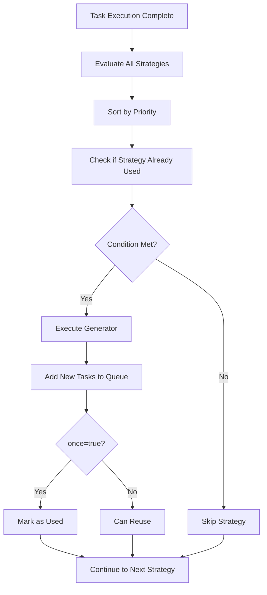

# 🚀 Intelligent Workflow Engine

A powerful workflow engine supporting DAG (Directed Acyclic Graph) task scheduling, dynamic task generation, and intelligent strategy systems.

[中文文档](./README.ZH.md)

## ✨ Core Features

### 🔄 **Powerful DAG Task Scheduling**
- Automatic task dependency resolution and topological sorting
- Intelligent parallel execution optimization
- Circular dependency detection
- Elegant error handling and recovery

### 🧠 **Intelligent Dynamic Strategy System**
- Condition-triggered task generation
- Dynamic planning based on task results
- Context change monitoring
- LLM-driven intelligent task planning

### ⚡ **High-Performance Execution Engine**
- O(V+E) complexity topological sorting
- Automatic parallel execution of independent tasks
- Memory optimization and lazy initialization
- Complete execution monitoring and metrics

## 🚀 Quick Start

### Installation

```bash
npm install agent-workflow
# or
yarn add agent-workflow  
# or
pnpm add agent-workflow
```

### Basic Usage - Simple Task Flow

```typescript
import { WorkflowBuilder } from 'agent-workflow';

// Define tasks
class DataProcessTask implements DAGTask {
  name = 'dataProcess';
  async execute(input: TaskInput) {
    const processed = input.rawData.toUpperCase();
    return { ...input, processed };
  }
}

class AnalysisTask implements DAGTask {
  name = 'analysis';
  async execute(input: TaskInput) {
    const analysis = `Analysis result: ${input.processed}`;
    return { ...input, analysis };
  }
}

// 🔥 Simple and powerful - 1 line does it all
const result = await WorkflowBuilder
  .create()
  .addTask(new DataProcessTask())
  .addTask(new AnalysisTask())
  .build()
  .execute({ rawData: 'hello world' });

console.log(result.data.analysis); // "Analysis result: HELLO WORLD"
```

### Intelligent Dynamic Workflow - Conditional Task Generation

```typescript
const workflow = WorkflowBuilder
  .create()
  .addTask(new CodeScanTask())
  .whenCondition(
    // When TypeScript files are detected
    (context) => {
      const fileTypes = context.get('discoveredTypes') as string[];
      return fileTypes?.includes('typescript');
    },
    // Automatically generate TS-related tasks
    async (context) => [
      new TypeCheckTask(),
      new TSLintTask(),
      new TypeCoverageTask()
    ]
  )
  .build();

const result = await workflow.execute({ projectPath: './src' });
console.log(`Intelligently generated ${result.dynamicTasksGenerated} tasks`);
```

### Dynamic Planning Based on Results

```typescript
const workflow = WorkflowBuilder
  .create()
  .addTask(new SecurityScanTask())
  .onTaskComplete('securityScan', async (result, context) => {
    const tasks = [];
    const issues = result.vulnerabilities || [];
    
    // Dynamically generate fix tasks based on scan results
    if (issues.includes('xss')) {
      tasks.push(new XSSFixTask());
    }
    if (issues.includes('sql-injection')) {
      tasks.push(new SQLInjectionFixTask());
    }
    
    return tasks;
  })
  .build();
```

### LLM-Driven Intelligent Workflow

```typescript
// 🤖 AI automatically plans task flow
const result = await WorkflowBuilder
  .create()
  .withLLMModel('gpt-4-turbo')
  .withDynamicPlanning('Analyze this Vue project and generate a code quality report')
  .build()
  .execute({ projectPath: './my-vue-app' });

console.log('AI-generated analysis report:', result.data);
```

## 🌊 Streaming Workflow - Real-time User Experience

### What is Streaming Workflow?

Traditional workflows wait for all tasks to complete before returning results, while streaming workflows can return real-time data during execution, perfect for:
- Long-running LLM tasks
- Scenarios requiring real-time feedback
- Frontend user experience optimization

### Basic Streaming Task Implementation

```typescript
class StreamingAnalysisTask {
  name = 'streamingAnalysis';
  isStreaming = true;

  // Regular execution method (compatibility)
  async execute(input: any): Promise<Record<string, any>> {
    return { analysis: 'Static result', timestamp: Date.now() };
  }

  // Streaming execution method
  async *executeStream(input: any): AsyncGenerator<string, Record<string, any>, unknown> {
    // Simulate LLM streaming response
    yield '🔍 Starting analysis...';
    yield '📊 Detecting project type...';
    yield '⚡ Generating optimization suggestions...';
    yield '✅ Analysis complete';
    
    return { 
      analysis: 'Complete analysis data',
      timestamp: Date.now() 
    };
  }
}
```

### Streaming Workflow Usage

```typescript
import { SimpleStreamingWorkflow } from './examples/streaming-workflow';

const streamingWorkflow = new SimpleStreamingWorkflow()
  .addTask(new StreamingAnalysisTask())
  .addTask(new StreamingOptimizationTask());

// 🌊 Streaming execution
for await (const chunk of streamingWorkflow.executeStream(input)) {
  switch (chunk.type) {
    case 'progress':
      console.log(`Progress: ${chunk.progress}%`);
      break;
    case 'data':
      console.log(`Data: ${chunk.content}`);
      break;
    case 'complete':
      console.log(`Task completed: ${chunk.taskName}`);
      break;
  }
}
```

### Frontend Integration Examples

#### 1. Server-side (Express + SSE)
```typescript
app.get('/api/workflow/stream', async (req, res) => {
  res.setHeader('Content-Type', 'text/event-stream');
  res.setHeader('Cache-Control', 'no-cache');
  res.setHeader('Connection', 'keep-alive');

  const workflow = new SimpleStreamingWorkflow()
    .addTask(new StreamingCodeAnalysisTask());

  for await (const chunk of workflow.executeStream(req.body)) {
    res.write(`data: ${JSON.stringify(chunk)}\n\n`);
  }
  
  res.end();
});
```

#### 2. Frontend (React)
```tsx
function WorkflowProgress() {
  const [messages, setMessages] = useState<string[]>([]);
  const [progress, setProgress] = useState(0);

  const startWorkflow = () => {
    const eventSource = new EventSource('/api/workflow/stream');
    
    eventSource.onmessage = (event) => {
      const chunk = JSON.parse(event.data);
      
      if (chunk.type === 'progress') {
        setProgress(chunk.progress);
      } else if (chunk.type === 'data') {
        setMessages(prev => [...prev, chunk.content]);
      }
    };
  };

  return (
    <div>
      <button onClick={startWorkflow}>Start Analysis</button>
      <progress value={progress} max={100} />
      <div>
        {messages.map((msg, i) => 
          <div key={i} className="message">{msg}</div>
        )}
      </div>
    </div>
  );
}
```

#### 3. Frontend (Vue)
```vue
<template>
  <div>
    <button @click="startWorkflow" :disabled="isRunning">
      {{ isRunning ? 'Running...' : 'Start Analysis' }}
    </button>
    <progress :value="progress" max="100"></progress>
    <div v-for="(msg, i) in messages" :key="i" class="message">
      {{ msg }}
    </div>
  </div>
</template>

<script setup>
import { ref } from 'vue';

const messages = ref([]);
const progress = ref(0);
const isRunning = ref(false);

const startWorkflow = async () => {
  isRunning.value = true;
  messages.value = [];
  progress.value = 0;

  const response = await fetch('/api/workflow/stream');
  const reader = response.body.getReader();
  const decoder = new TextDecoder();

  try {
    while (true) {
      const { value, done } = await reader.read();
      if (done) break;

      const chunk = decoder.decode(value);
      const lines = chunk.split('\n');
      
      for (const line of lines) {
        if (line.startsWith('data: ')) {
          const data = JSON.parse(line.slice(6));
          
          if (data.type === 'progress') {
            progress.value = data.progress;
          } else if (data.type === 'data') {
            messages.value.push(data.content);
          }
        }
      }
    }
  } finally {
    isRunning.value = false;
  }
};
</script>

### Streaming Workflow Benefits

- **✨ Real-time Feedback** - Users see progress immediately
- **🚀 Long Task Support** - Perfect for time-consuming LLM analysis
- **📊 Progress Visualization** - Clear progress bars and status
- **🔄 Pausable/Resumable** - Support for pause and continue
- **💬 Real-time Response** - LLM streaming output directly displayed
- **🎯 Frontend-friendly** - Perfect user experience

### Data Format

Streaming workflows return standardized data chunks:

```typescript
interface StreamingChunk {
  type: 'progress' | 'data' | 'error' | 'complete';
  taskName: string;
  content?: any;
  progress?: number;        // 0-100
  timestamp: number;
  metadata?: Record<string, any>;
}
```

Through streaming workflows, you can provide users with ChatGPT-like real-time response experience!

## 🤖 AI SDK Compatible Streaming

### Perfect AI SDK Integration

Our workflow system provides **100% API compatibility** with [AI SDK](https://github.com/vercel/ai) while offering powerful workflow orchestration:

```typescript
// 🔥 AI SDK Compatible Streaming Tasks
class AICodeAnalysisTask implements DAGTask {
  name = 'aiCodeAnalysis';
  isAISDKStreaming = true;

  async executeStreamAI(input: TaskInput) {
    const { textStream, fullStream } = await streamText({
      model: openai('gpt-4-turbo'),
      prompt: `Analyze this code: ${input.code}`,
    });

    return {
      textStream,
      fullStream,
      toDataStreamResponse: () => new Response(/* SSE stream */),
      toReadableStream: () => new ReadableStream(/* text stream */)
    };
  }
}

// 🚀 Build AI SDK Compatible Workflow
const aiWorkflow = WorkflowBuilder
  .create()
  .addTask(new AICodeAnalysisTask())
  .addTask(new AIDocumentationTask())
  .buildAISDKStreaming(); // 🔥 AI SDK Compatible Builder

// 💫 Use Exactly Like AI SDK
const result = aiWorkflow.executeStreamAISDK(input);

// Same API as AI SDK streamText!
for await (const textChunk of result.textStream) {
  console.log(textChunk); // Real-time AI output
}

// Or use in Express routes - zero code changes needed!
app.post('/api/ai/analyze', async (req, res) => {
  const workflow = WorkflowBuilder
    .create()
    .addTask(new AICodeAnalysisTask())
    .buildAISDKStreaming();

  const streamResult = workflow.executeStreamAISDK(req.body);
  
  // 🎯 Return exactly like AI SDK
  return streamResult.toDataStreamResponse();
});
```

### AI SDK vs Our Implementation

| Feature | AI SDK `streamText()` | Our AI Workflow |
|---------|----------------------|------------------|
| **API Compatibility** | ✅ Simple | ✅ 100% Compatible |
| **Multi-task Orchestration** | ❌ Single task | ✅ Complex workflows |
| **Dynamic Task Generation** | ❌ No | ✅ Intelligent strategies |
| **Parallel Execution** | ❌ Sequential | ✅ Automatic optimization |
| **Dependency Management** | ❌ No | ✅ DAG-based dependencies |
| **Error Recovery** | ❌ Basic | ✅ Advanced fault tolerance |
| **Context Management** | ❌ Limited | ✅ Rich context system |
| **Performance** | ✅ Good | ✅ Optimized + Parallel |

**🎯 Key Benefits:**
- **Zero Migration Cost** - Same API as AI SDK
- **Workflow Power** - Multi-task orchestration with single-call simplicity  
- **AI-First Design** - Built for LLM applications
- **Production Ready** - Advanced error handling and monitoring

## 🎭 Simple Agent-Style API

### OpenAI Agent SDK Compatible

We provide a **simplified Agent API** that's almost identical to OpenAI's Agent SDK but with much more power under the hood:

```typescript
// 🤖 Define Agents (exactly like OpenAI Agent SDK)
const supportAgent = new Agent(
  'Support & Returns',
  'You are a support agent who can submit refunds and handle customer service issues.',
  [submitRefundRequest] // tools
);

const shoppingAgent = new Agent(
  'Shopping Assistant',
  'You are a shopping assistant who can search the web for products.',
  [webSearch, analyzeOutfit]
);

const triageAgent = new Agent(
  'Triage Agent',
  'Route the user to the correct agent based on their query.',
  [],
  [shoppingAgent, supportAgent] // handoffs
);

// 🚀 Run Exactly Like OpenAI Agent SDK
const output = await Runner.runSync({
  startingAgent: triageAgent,
  input: "What shoes might work best with my navy blazer outfit?"
});

console.log(output);
// {
//   "recommendation": "Based on your outfit, suggest brown or navy casual shoes",
//   "suggestedProducts": [
//     {"name": "Clarks Desert Boots", "price": "$120", "match": "95%"}
//   ]
// }
```

### API Comparison: OpenAI vs Ours

```python
# OpenAI Agent SDK (Python)
output = Runner.run_sync(
    starting_agent=triage_agent,
    input="What shoes work with my outfit?"
)
```

```typescript
// Our Implementation (TypeScript) - Nearly Identical!
const output = await Runner.runSync({
  startingAgent: triageAgent,
  input: "What shoes work with my outfit?"
});
```

**🎯 Core Advantages Over OpenAI Agent SDK:**

- ✅ **API Simplicity**: Nearly identical interface
- ✅ **More Powerful**: Complex workflow capabilities underneath
- ✅ **Type Safety**: Full TypeScript support
- ✅ **Flexibility**: Can expand to multi-step workflows
- ✅ **Performance**: Automatic parallel execution and optimization
- ✅ **Advanced Features**: Dynamic strategies, streaming, context management

## 🧠 AI-Powered Workflow Planning

### Intelligent Planner System

Our AI Planner can analyze user requests and automatically generate optimized workflow configurations:

```typescript
// 🧠 AI Planner analyzes requests and generates workflows
class AIPlannerTask implements DAGTask {
  async execute(input: TaskInput) {
    const userRequest = input.userRequest;
    
    // AI analyzes: "Analyze my React TypeScript project and optimize it"
    const workflowPlan = await this.generateWorkflowPlan(userRequest);
    
    return { workflowPlan };
  }
}

// 🚀 Planner generates intelligent workflow configurations
const plannerWorkflow = WorkflowBuilder
  .create()
  .addTask(new AIPlannerTask())
  .onTaskComplete('aiPlanner', async (result, context) => {
    const plan = result.workflowPlan;
    
    // 🎯 Execute dynamically generated workflow
    return await PlanExecutor.executePlan(plan, context.getAll());
  })
  .build();

// 💫 Single line creates complex workflows
const result = await plannerWorkflow.execute({
  userRequest: "Create a weather app with AI features using Python FastAPI"
});
```

### AI Planner Output Example

The AI Planner generates structured JSON workflows:

```json
{
  "workflow": {
    "description": "AI-powered weather app development",
    "staticTasks": [
      {
        "type": "WebSearchTask",
        "name": "weatherApiResearch",
        "config": {"query": "best weather APIs 2024", "maxResults": 5}
      },
      {
        "type": "FileOperationTask",
        "name": "projectSetup", 
        "config": {"action": "create", "structure": "fastapi-project"}
      }
    ],
    "dynamicStrategies": [
      {
        "type": "onTaskComplete",
        "name": "apiSelectionStrategy",
        "trigger": "After weather API research completes",
        "generateTasks": [
          {
            "type": "CodeGenerationTask",
            "name": "weatherService",
            "config": {"component": "weather-service", "framework": "fastapi"}
          }
        ]
      }
    ]
  }
}
```

**🎯 AI Planner Features:**
- **Smart Request Analysis** - Understands intent and requirements
- **Optimized Task Selection** - Chooses best tasks for the job  
- **Dynamic Strategy Generation** - Creates intelligent conditional logic
- **Multi-scenario Support** - React analysis, app development, general queries
- **JSON-Driven Execution** - Structured, reproducible workflows

## 🎛️ Advanced Configuration

### Complete Configuration Example

```typescript
const workflow = WorkflowBuilder
  .create()
  .withConfig({
    llmModel: 'gpt-4-turbo',
    retryAttempts: 3,
    timeoutMs: 60000,
    maxDynamicSteps: 20
  })
  .addTask(new InitTask())
  .addDynamicStrategy({
    name: 'error_recovery',
    condition: (context) => context.get('hasError') === true,
    generator: async (context) => [new ErrorRecoveryTask()],
    priority: 10, // High priority
    once: true    // Execute only once
  })
  .build();
```

### Task Dependency Management

```typescript
const task1 = new DataFetchTask();
const task2 = new DataProcessTask();
task2.dependsOn = [task1]; // Declare dependency

const task3 = new DataAnalysisTask();
task3.dependsOn = [task1, task2]; // Multiple dependencies

const workflow = WorkflowBuilder
  .create()
  .addTasks([task1, task2, task3]) // Automatically handle dependency order
  .build();
```

## 🔧 Dynamic Strategy System

Dynamic strategies are the intelligent core of the workflow engine, enabling **adaptive task generation** based on runtime conditions. They give workflows the ability to intelligently adjust execution plans during runtime.

### 🎯 Dynamic Strategy Architecture

```typescript
interface DynamicStrategy {
  name: string;                                           // Strategy identifier  
  condition: (context: WorkflowContext, result?: any) => boolean;  // Trigger condition
  generator: (context: WorkflowContext) => Promise<DAGTask[]>;     // Task generator
  priority?: number;                                      // Execution priority (higher = first)
  once?: boolean;                                         // One-time execution flag
}
```

### 📋 Strategy Parameters Explained

#### **name: string**
- **Purpose**: Unique identifier for the strategy
- **Usage**: 
  - Display in logs and monitoring
  - Track executed strategies when `once: true`
  - Debug and troubleshooting

#### **condition: (context, result?) => boolean**
- **Purpose**: Determines when strategy should trigger
- **Mechanism**: 
  - Called after each execution step
  - Receives current workflow context
  - Returns `true` to trigger, `false` to skip

#### **generator: (context) => Promise<DAGTask[]>**
- **Purpose**: Dynamically generates new tasks
- **Mechanism**:
  - Called when condition is met
  - Receives current context as parameter
  - Returns array of new tasks to add to workflow

#### **priority?: number (default: 0)**
- **Purpose**: Controls strategy execution order
- **Mechanism**:
  ```typescript
  // Strategies sorted by priority (high to low)
  const sortedStrategies = [...strategies].sort(
    (a, b) => (b.priority || 0) - (a.priority || 0)
  );
  ```
- **Typical Usage**:
  - `priority: 10` - High priority (error handling, critical tasks)
  - `priority: 5` - Medium priority (regular business logic)  
  - `priority: 1` - Low priority (cleanup, logging)

#### **once?: boolean (default: false)**
- **Purpose**: Controls whether strategy can execute multiple times
- **Mechanism**:
  ```typescript
  // Skip already-used one-time strategies
  if (strategy.once && this.usedStrategies.has(strategy.name)) {
    continue;
  }
  
  // Mark strategy as used
  if (strategy.once) {
    this.usedStrategies.add(strategy.name);
  }
  ```
- **Use Cases**:
  - `once: true` - Initialization, error recovery, one-time setup
  - `once: false` - Continuous monitoring, repeated tasks

### 🔄 Strategy Execution Flow



### 1. Condition Strategy - `whenCondition()`

```typescript
.whenCondition(
  (context) => context.get('environment') === 'production',
  async (context) => [
    new SecurityAuditTask(),
    new PerformanceTestTask()
  ]
)
```

### 2. Task Completion Strategy - `onTaskComplete()`

```typescript
.onTaskComplete('codeAnalysis', async (result, context) => {
  const tasks = [];
  
  if (result.complexity > 0.8) {
    tasks.push(new RefactorSuggestionTask());
  }
  
  if (result.coverage < 0.7) {
    tasks.push(new TestGenerationTask());
  }
  
  return tasks;
})
```

### 3. Context Change Strategy - `onContextChange()`

```typescript
.onContextChange('framework', async (framework, context) => {
  switch (framework) {
    case 'react':
      return [new ReactLintTask(), new ReactTestTask()];
    case 'vue':
      return [new VueLintTask(), new VueTestTask()];
    case 'angular':
      return [new AngularLintTask(), new AngularTestTask()];
    default:
      return [new GenericLintTask()];
  }
})
```

### 4. Custom Strategy - `addDynamicStrategy()`

```typescript
.addDynamicStrategy({
  name: 'performance_optimization',
  condition: (context, result) => {
    const metrics = context.get('performanceMetrics');
    return metrics?.loadTime > 3000; // Load time over 3 seconds
  },
  generator: async (context) => [
    new ImageOptimizationTask(),
    new CodeSplittingTask(),
    new CacheOptimizationTask()
  ],
  priority: 5,
  once: false // Can trigger multiple times
})
```

### 💡 Real-World Strategy Examples

#### 🚨 Error Recovery Strategy
```typescript
.addDynamicStrategy({
  name: 'error_recovery',
  condition: (context) => context.get('hasError') === true,
  generator: async (context) => [
    new ErrorAnalysisTask(),     // Analyze error
    new ErrorFixTask(),          // Fix error  
    new ValidationTask()         // Validate fix
  ],
  priority: 10,  // Highest priority - handle errors first
  once: true     // One-time only - avoid infinite error loops
})
```

#### 🔍 Performance Monitoring Strategy
```typescript
.addDynamicStrategy({
  name: 'performance_monitoring', 
  condition: (context) => {
    const metrics = context.get('performanceMetrics');
    return metrics?.loadTime > 5000; // Over 5 seconds
  },
  generator: async (context) => [
    new PerformanceOptimizationTask(),
    new CacheOptimizationTask()
  ],
  priority: 5,   // Medium priority
  once: false    // Can trigger repeatedly for continuous monitoring
})
```

#### 🧪 Test Coverage Strategy
```typescript
.addDynamicStrategy({
  name: 'test_coverage_boost',
  condition: (context) => {
    const coverage = context.get('testCoverage');
    return coverage < 0.8; // Coverage below 80%
  },
  generator: async (context) => [
    new TestGenerationTask(),
    new CoverageAnalysisTask()
  ],
  priority: 3,   // Lower priority
  once: true     // One-time generation is sufficient
})
```

### 🎯 Strategy Design Best Practices

#### 1. **Priority Design Principles**
```typescript
// Emergency situations - Highest priority
priority: 10  // Error recovery, security issues
priority: 8   // Data consistency, critical business

// Regular business - Medium priority  
priority: 5   // Normal business logic
priority: 3   // Optimization improvements

// Support functions - Low priority
priority: 1   // Logging, cleanup tasks
priority: 0   // Statistics, reporting
```

#### 2. **Once Parameter Selection**
```typescript
// once: true use cases
- Initialization tasks
- Error recovery  
- One-time configuration
- Data migration

// once: false use cases  
- Performance monitoring
- Data synchronization
- Continuous optimization
- Periodic checks
```

#### 3. **Condition Design Tips**
```typescript
// Simple boolean condition
condition: (context) => context.get('needsOptimization') === true

// Complex logic condition
condition: (context) => {
  const metrics = context.get('metrics');
  const config = context.get('config');
  return metrics?.errorRate > 0.05 && config?.env === 'production';
}

// Execution history-based condition
condition: (context) => {
  const history = context.getExecutionHistory();
  return history.some(h => h.status === 'failed');
}
```

This dynamic strategy system gives workflows **adaptive intelligence**, enabling them to intelligently adjust execution plans based on real-time conditions during execution! 🚀

## 📊 Execution Monitoring and Results

### Detailed Execution Results

```typescript
interface WorkflowResult {
  success: boolean;                              // Success status
  data?: any;                                   // Final data
  error?: Error;                                // Error information
  executionTime: number;                        // Total execution time (ms)
  taskResults: Map<string, TaskExecutionResult>; // Detailed results for each task
  dynamicTasksGenerated?: number;               // Number of dynamically generated tasks
  totalSteps?: number;                          // Total execution steps
}

// Usage example
const result = await workflow.execute();

if (result.success) {
  console.log(`✅ Workflow completed successfully`);
  console.log(`📊 Execution time: ${result.executionTime}ms`);
  console.log(`🎯 Dynamic tasks generated: ${result.dynamicTasksGenerated}`);
  console.log(`📈 Total execution steps: ${result.totalSteps}`);
  
  // View specific task results
  result.taskResults.forEach((taskResult, taskName) => {
    console.log(`Task ${taskName}: ${taskResult.status} (${taskResult.duration}ms)`);
  });
} else {
  console.error(`❌ Workflow failed:`, result.error?.message);
}
```

### Execution History Tracking

```typescript
const workflow = WorkflowBuilder.create()
  .addTask(new TaskA())
  .addTask(new TaskB())
  .build();

await workflow.execute();

// Get detailed execution history
const history = workflow.getContext().getExecutionHistory();
history.forEach(record => {
  console.log(`${record.taskName}: ${record.status} (${record.duration}ms)`);
});
```

## 🎯 Best Practices

### 1. Task Design Principles

```typescript
class WellDesignedTask implements DAGTask {
  constructor(
    public name: string,
    private config: TaskConfig
  ) {}

  async execute(input: TaskInput): Promise<Record<string, any>> {
    // ✅ Input validation
    this.validateInput(input);
    
    // ✅ Idempotent design
    if (this.isAlreadyProcessed(input)) {
      return this.getCachedResult(input);
    }
    
    // ✅ Core business logic
    const result = await this.processData(input);
    
    // ✅ Result caching
    this.cacheResult(input, result);
    
    return result;
  }
}
```

### 2. Error Handling Strategy

```typescript
const robustWorkflow = WorkflowBuilder
  .create()
  .withConfig({ 
    retryAttempts: 3,
    timeoutMs: 30000 
  })
  .addTask(new RiskyTask())
  .addDynamicStrategy({
    name: 'error_fallback',
    condition: (context) => context.get('lastTaskFailed'),
    generator: async (context) => [new FallbackTask()],
    priority: 1
  })
  .build();
```

### 3. Performance Optimization Tips

- **Parallel optimization**: Reduce unnecessary task dependencies
- **Memory management**: Clean up large objects promptly
- **Lazy loading**: Initialize heavy components on demand
- **Strategy priority**: Set reasonable strategy execution order

## 📚 More Examples

Check the [examples](./examples) directory for more practical use cases:

### 🚀 Run Examples

```bash
# 1. Basic workflow example - Shows simple task dependencies and execution
npx tsx examples/basic-workflow.ts

# 2. Dynamic strategy example - Shows four dynamic strategies in action
npx tsx examples/dynamic-strategies.ts

# 3. LLM integration example - Shows AI-driven workflows (simulated)
npx tsx examples/llm-integration.ts

# 4. Error handling example - Shows fault tolerance and recovery strategies
npx tsx examples/error-handling.ts

# 5. Streaming workflow example - Shows real-time streaming data return
npx tsx examples/streaming-workflow.ts

# 🔥 NEW: Advanced AI Features
# 6. AI SDK streaming example - Shows AI SDK compatible workflows
npx tsx examples/ai-sdk-streaming-workflow.ts

# 7. Simple Agent API example - Shows OpenAI Agent SDK compatible interface
npx tsx examples/simple-agent-style.ts

# 8. AI Planner example - Shows intelligent workflow generation
npx tsx examples/ai-planner-workflow.ts
```

### 📖 Example Descriptions

| Example File | Features | Learning Points |
|---------|---------|----------|
| **basic-workflow.ts** | • Task definition and dependencies<br>• Workflow construction<br>• Result retrieval | Quick start with WorkflowBuilder basics |
| **dynamic-strategies.ts** | • 4 dynamic strategies<br>• Condition triggering<br>• Intelligent task generation | Master core dynamic workflow functionality |
| **llm-integration.ts** | • AI task planning<br>• Streaming processing<br>• Intelligent decision making | Understand LLM-driven workflow applications |
| **error-handling.ts** | • Error handling<br>• Recovery strategies<br>• Fault tolerance mechanisms | Learn to build robust workflow systems |
| **streaming-workflow.ts** | • Real-time streaming execution<br>• Frontend-friendly returns<br>• Progress visualization | Master streaming workflow implementation and frontend integration |
| **🔥 ai-sdk-streaming-workflow.ts** | • **AI SDK compatibility**<br>• **100% API compatibility**<br>• **Express integration** | Master AI SDK compatible workflows for LLM apps |
| **🔥 simple-agent-style.ts** | • **OpenAI Agent SDK style**<br>• **Agent handoffs**<br>• **Tool functions** | Learn simplified Agent API for rapid development |
| **🔥 ai-planner-workflow.ts** | • **AI-driven planning**<br>• **Smart task generation**<br>• **JSON workflow configs** | Understand intelligent workflow planning |

### 🎯 Quick Experience

If you want to quickly experience all examples, you can run:

```bash
# Install dependencies
npm install

# Run all examples in sequence
npm run examples
```

Or create a simple script to run:

```bash
# Create run script
cat > run-examples.sh << 'EOF'
#!/bin/bash
echo "🚀 Running WorkflowBuilder Examples"
echo "================================="

echo -e "\n1️⃣ Basic workflow example"
npx tsx examples/basic-workflow.ts

echo -e "\n2️⃣ Dynamic strategy example" 
npx tsx examples/dynamic-strategies.ts

echo -e "\n3️⃣ LLM integration example"
npx tsx examples/llm-integration.ts

echo -e "\n4️⃣ Error handling example"
npx tsx examples/error-handling.ts

echo -e "\n5️⃣ Streaming workflow example"
npx tsx examples/streaming-workflow.ts

echo -e "\n6️⃣ AI SDK streaming example"
npx tsx examples/ai-sdk-streaming-workflow.ts

echo -e "\n7️⃣ Simple Agent API example"
npx tsx examples/simple-agent-style.ts

echo -e "\n8️⃣ AI Planner example"
npx tsx examples/ai-planner-workflow.ts

echo -e "\n✅ All examples completed!"
EOF

chmod +x run-examples.sh
./run-examples.sh
```

## 🤝 Contributing

1. Fork this repository
2. Create your feature branch (`git checkout -b feature/AmazingFeature`)
3. Commit your changes (`git commit -m 'Add some AmazingFeature'`)
4. Push to the branch (`git push origin feature/AmazingFeature`)
5. Open a Pull Request

## 📄 License

MIT © [FormAgent](https://github.com/FormAgent)

Make workflow development simpler, more powerful, and more intelligent! 🚀
