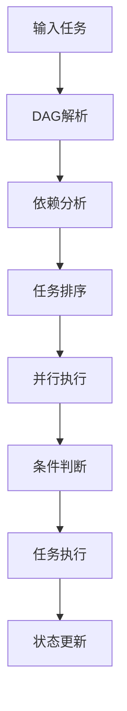

# Workflow Engine

一个强大的工作流引擎，支持 DAG（有向无环图）任务调度、条件分支、并行执行和上下文管理。

## 特性

- 🔄 DAG 任务调度
  - 支持复杂的任务依赖关系
  - 自动检测循环依赖
  - 支持多层级任务执行
  
- 🔀 条件分支
  - 动态条件判断
  - 多分支路径选择
  - 默认分支支持
  
- ⚡ 并行执行
  - 同级任务并行处理
  - 支持多任务组合
  
- 📦 上下文管理
  - 任务间数据共享
  - 动态上下文更新
  - 状态追踪

## 安装

```bash
npm install workflow-engine
# 或
yarn add workflow-engine
# 或
pnpm add workflow-engine
```

## 快速开始

### 基础用法

```typescript
import { 
  DAGWorkflowEngine, 
  TaskExecutor, 
  ContextManager,
  type Task,
  type TaskInput 
} from 'workflow-engine';

// 定义任务
class MyTask implements Task {
  name = 'MyTask';
  async execute(input: TaskInput) {
    // 任务逻辑
    return { result: 'done' };
  }
}

// 创建工作流
const context = new ContextManager();
const executor = new TaskExecutor(context);
const engine = new DAGWorkflowEngine(executor);

// 运行任务
const task = new MyTask();
await engine.run({ tasks: [task] });
```

### 条件分支示例

```typescript
import { type DAGTask, type ContextManager } from 'workflow-engine';

class ConditionalTask implements DAGTask {
  name = 'ConditionalTask';
  branches = [{
    condition: (ctx: ContextManager) => ctx.get('value') > 5,
    next: new TaskB()
  }];
  defaultNext = new TaskC();
}
```

## 架构设计

### 核心模块

1. **DAG 解析器** (DAGParser)
   - 任务依赖分析
   - 执行顺序确定
   - 循环依赖检测

2. **工作流引擎** (WorkflowEngine)
   - 任务调度
   - 分支处理
   - 状态管理

3. **上下文管理器** (ContextManager)
   - 数据存储
   - 状态共享
   - 上下文隔离

4. **任务执行器** (TaskExecutor)
   - 任务生命周期管理
   - 错误处理
   - 重试机制

### 工作流程



## API 文档

### DAGTask 接口

```typescript
interface DAGTask extends Task {
  dependsOn?: DAGTask[];
  branches?: {
    condition: (context: ContextManager) => boolean;
    next: DAGTask | DAGTask[];
  }[];
  defaultNext?: DAGTask | DAGTask[];
}
```

### ContextManager 类

```typescript
class ContextManager {
  set(key: string, value: any): void;
  get(key: string): any;
  getAll(): Record<string, any>;
  clear(): void;
}
```

更多 API 文档请参考 [API 文档](./docs/api.md)

## 测试

```bash
pnpm test
```

## 构建

```bash
pnpm build
```

## 贡献指南

1. Fork 本仓库
2. 创建特性分支 (`git checkout -b feature/AmazingFeature`)
3. 提交更改 (`git commit -m 'Add some AmazingFeature'`)
4. 推送到分支 (`git push origin feature/AmazingFeature`)
5. 开启 Pull Request

## 许可证

MIT © [baryon](https://github.com/baryon)