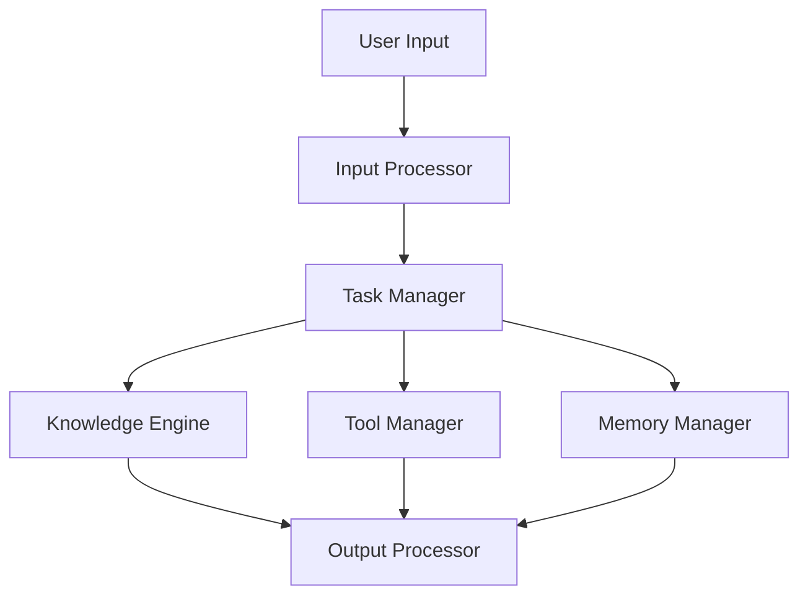

# AI Agent Workflow

# My TypeScript Project

AI Agent 程序可以采用 分层模块化设计，将系统划分为独立的层和模块，每个模块承担单一职责，彼此松耦合、易于扩展。

整体架构：
输入层 (Input Layer)

处理用户输入的验证、清洗和标准化。
提取上下文、意图和实体等关键信息。
核心处理层 (Processing Core Layer)

任务调度：决定 Agent 的行为路径（如直接回答、调用工具、生成问题等）。
知识处理：调用预训练模型、知识库或外部接口生成回答。
决策引擎：管理多任务处理、优先级调度和动作选择。
工具层 (Tools Layer)

提供外部功能，例如搜索、数据库查询、API 调用、计算功能等。
工具模块独立于核心逻辑，支持热插拔。
记忆与上下文管理层 (Memory & Context Management)

记录对话历史、用户状态、任务上下文。
动态调整回答，维持对话一致性和关联性。
输出层 (Output Layer)

将 AI 生成的结果格式化，适配输出方式（如文本、语音或 API 返回）。
设计原则
单一职责 (Single Responsibility)

每个模块只负责一个独立功能，避免逻辑混乱。
开放封闭原则 (Open-Closed Principle)

系统对扩展开放，对修改封闭。通过接口和抽象实现可扩展性。
模块化与组合性 (Modularity & Composability)

各功能模块可独立运行，支持组合和重用。
解耦与松耦合 (Decoupling)

核心逻辑与外部工具、数据源解耦，方便替换实现。
状态管理 (State Management)

清晰管理用户上下文、对话状态，支持多轮对话和动态决策。
异步与并发 (Asynchronous Processing)

支持异步任务，提升性能和响应速度。
实现细节与代码示例

架构模块示意图


## 项目结构

```
my-ai-agent
├── src
│   ├── agents
│   │   └── aiAgent.ts
│   ├── input
│   │   └── inputProcessor.ts
│   ├── process
│   │   └── taskManager.ts
│   ├── tools
│   │   └── toolManager.ts
│   ├── knowledge
│   │   └── knowledgeEngine.ts
│   ├── memory
│   │   └── memoryManager.ts
│   ├── output
│   │   └── outputProcessor.ts
│   ├── utils
│   │   └── logger.ts
│   ├── index.ts
├── package.json
├── tsconfig.json
└── README.md
```

## 安装依赖

在项目根目录下运行以下命令以安装依赖：

```
npm install
```

## 编译项目

使用以下命令编译 TypeScript 代码：

```
npm run build
```

## 运行项目

使用以下命令运行应用程序：

```
npm start
```

## 贡献

欢迎任何形式的贡献！请提交问题或拉取请求。