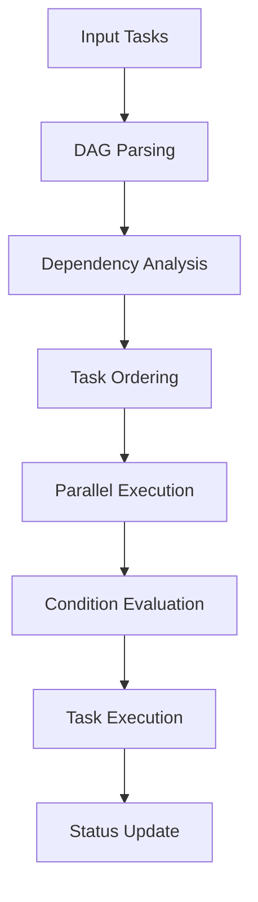

# Workflow Engine

A powerful workflow engine that supports DAG (Directed Acyclic Graph) task scheduling, conditional branching, parallel execution, and context management.

[中文文档](./README.ZH.md)

## Features

- 🔄 DAG Task Scheduling
  - Complex task dependency support
  - Automatic cycle detection
  - Multi-level task execution
  - Task retry mechanism
  
- 🔀 Conditional Branching
  - Dynamic condition evaluation
  - Multiple branch path selection
  - Default branch support
  
- ⚡ Parallel Execution
  - Same-level task parallelization
  - Multi-task combination support
  
- 📦 Context Management
  - Inter-task data sharing
  - Dynamic context updates
  - Status tracking
  - Task status change notifications

## Installation

```bash
npm install workflow-engine
# or
yarn add workflow-engine
# or
pnpm add workflow-engine
```

## Quick Start

### Basic Usage

```typescript
import { 
  DAGWorkflowEngine, 
  TaskExecutor, 
  ContextManager,
  type Task,
  type TaskInput 
} from 'workflow-engine';

// Define a task
class MyTask implements Task {
  name = 'MyTask';
  async execute(input: TaskInput) {
    // Task logic
    if (!someCondition) throw new Error('Task failed');
    return { result: 'done' };
  }
}

// Create workflow
const context = new ContextManager();
const executor = new TaskExecutor(context);
const engine = new DAGWorkflowEngine(executor);

// Listen to task status changes
engine.on('taskStatusChanged', (task, status) => {
  console.log(`Task ${task.name} status changed to ${status}`);
});

// Run task
const task = new MyTask();
await engine.run({ tasks: [task] });
```

### Conditional Branch Example

```typescript
import type { DAGTask, ContextManager } from 'workflow-engine';

class ConditionalTask implements DAGTask {
  name = 'ConditionalTask';
  branches = [{
    condition: (ctx: ContextManager) => ctx.get('value') > 5,
    retryCount: 3,
    next: new TaskB()
  }];
  defaultNext = new TaskC();
}
```

## Architecture

### Core Modules

1. **DAG Parser** (DAGParser)
   - Task dependency analysis
   - Execution order determination
   - Cycle detection

2. **Workflow Engine** (WorkflowEngine)
   - Task scheduling
   - Branch handling
   - Status management

3. **Context Manager** (ContextManager)
   - Data storage
   - State sharing
   - Context isolation

4. **Task Executor** (TaskExecutor)
   - Task lifecycle management
   - Error handling
   - Retry mechanism

### Workflow Process



## API Documentation

### DAGTask Interface

```typescript
interface DAGTask extends Task {
  dependsOn?: DAGTask[];
  branches?: {
    condition: (context: ContextManager) => boolean;
    next: DAGTask | DAGTask[];
  }[];
  defaultNext?: DAGTask | DAGTask[];
}
```

### ContextManager Class

```typescript
class ContextManager {
  set(key: string, value: any): void;
  get(key: string): any;
  getAll(): Record<string, any>;
  clear(): void;
}
```

For more API documentation, please refer to [API Documentation](./docs/api.md)

## Testing

```bash
pnpm test
```

## Build

```bash
pnpm build
```

## Contributing

1. Fork the repository
2. Create your feature branch (`git checkout -b feature/AmazingFeature`)
3. Commit your changes (`git commit -m 'Add some AmazingFeature'`)
4. Push to the branch (`git push origin feature/AmazingFeature`)
5. Open a Pull Request

## License

MIT © [baryon](https://github.com/baryon)